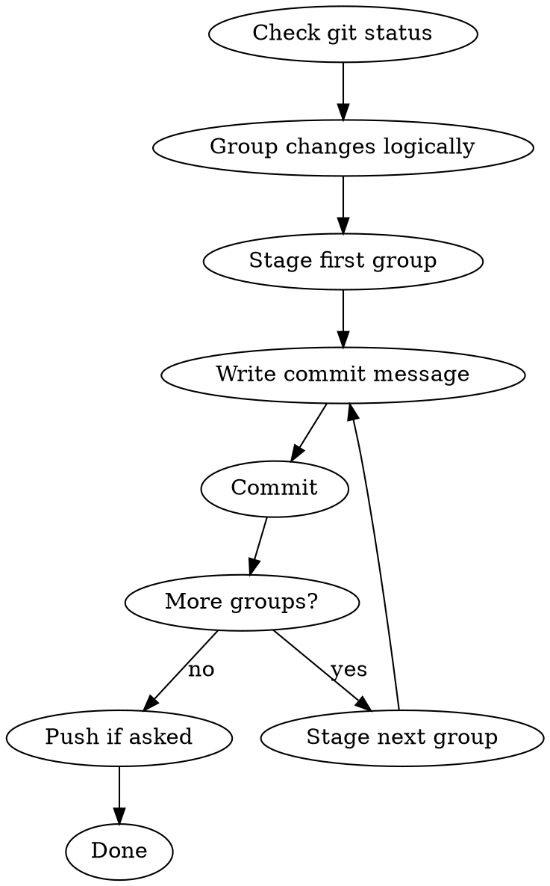

# Commit

Save work to git in small, logical, atomic commits. One idea per commit. No batch noise.

## When to Use

- User asks to commit changes
- User asks to push to GitHub
- User asks for an atomic commit
- User says "save my work" and the repo has uncommitted changes
- After completing a discrete task that changes files

## When NOT to Use

- The repo has no changes
- User explicitly says not to commit
- The changes are temporary, generated, or should be ignored

## Core Principles

1. **One idea per commit.** A commit should contain one logical change, not a mixed bag.
2. **Atomic commits.** A commit should leave the repo in a working state. If tests exist and are relevant, they should pass.
3. **Clear messages.** A commit message says what changed and why. No "update" or "fix".
4. **Stage deliberately.** Do not use `git add .` blindly. Stage files that belong together.
5. **Separate unrelated changes.** If two changes are unrelated, make two commits.
6. **Don't commit generated files.** Build outputs, dependencies, and temp files stay out.
7. **Push only when asked.** Commit locally by default. Push when the user asks or confirms.

## Workflow



## Execution Steps

### Step 1: Inspect the Repo

Run:
```bash
git status --short
```

Also check for untracked files that should probably be ignored:
```bash
git status --short --untracked-files=all
```

### Step 2: Group Changes

Look at the changed files and group them into logical commits. Common groupings:

- **Feature work:** source code + tests for one feature
- **Config/infra:** Docker, CI, environment files
- **Docs:** README, AGENTS.md, comments
- **Skill changes:** one skill per commit
- **Refactor:** mechanical renames or moves without behavior changes
- **Style/formatting:** only formatting, no logic

If a single file contains unrelated changes, consider whether to split it with `git add -p`. For simple files, one commit is fine.

### Step 3: Stage and Commit Each Group

For each group:

1. Stage only the files in that group:
   ```bash
   git add <file1> <file2> ...
   ```

2. Write a commit message following this format:
   ```
   <type>: <short summary>

   <optional body explaining why>
   ```

   Types:
   - `feat:` new feature
   - `fix:` bug fix
   - `docs:` documentation only
   - `style:` formatting, no logic
   - `refactor:` code change that neither fixes nor adds
   - `test:` adding or updating tests
   - `chore:` build, config, tooling
   - `skill:` adding or updating an agent skill

3. Commit:
   ```bash
   git commit -m "<type>: <summary>" -m "<body if needed>"
   ```

### Step 4: Push if Asked

If the user asked to push:
```bash
git push
```

If the current branch has no upstream:
```bash
git push -u origin $(git branch --show-current)
```

## Commit Message Rules

- Keep the summary under 50 characters when possible.
- Use the imperative mood: "add" not "added" or "adds".
- Explain what and why in the body, not how.
- Reference issue numbers only if they exist and are relevant.

## Examples

Good:
```
skill: port humanise-text skill to be agent-agnostic

Remove Claude-specific paths and the Opus subagent requirement.
Replace the Python-script-dependent workflow with a direct
rewrite workflow that any agent can follow.
```

Good:
```
feat: humanise landing page copy

Apply banned-pattern and structural rules from the humanise-text
skill. Replace passive voice, break tricolons, and tighten wording
while preserving the minimalist-ui visual structure.
```

Bad:
```
update
```

Bad:
```
fix stuff and add feature
```

## Safety Checks

Before committing:
- Do not commit files that are only build outputs or dependencies.
- Do not commit `.env`, secrets, or credential files.
- Do not commit if the user has explicitly asked not to.
- If tests are relevant and quick, run them before the final commit.

After committing:
- Run `git status --short` to confirm nothing was missed.
- Report the commits made to the user.
