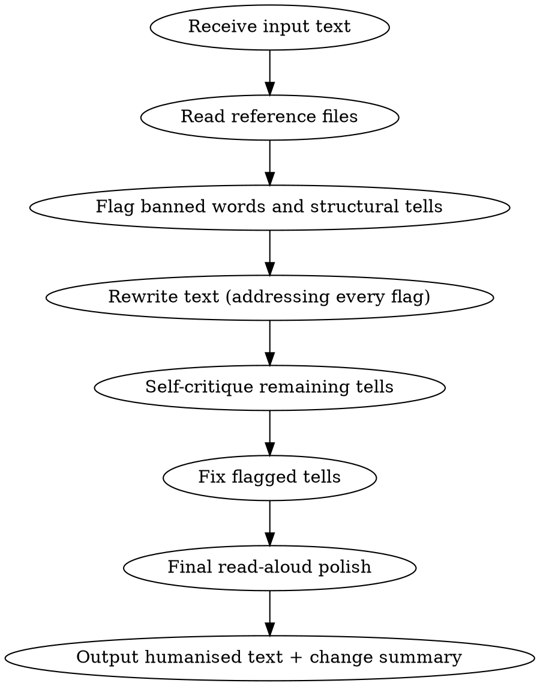

# Humanise Text

Strip every detectable sign of AI writing. Output prose where every word is chosen with precision, intention, and meaning.

## When to Use

- User pastes text and asks to humanise/humanize it
- User asks to remove AI patterns or make text sound natural
- User asks to "de-slop" or "clean up" AI writing
- Text needs to pass as human-written

## When NOT to Use

- Creative fiction or poetry (the rules don't apply)
- User wants AI style preserved
- Text is already human-written and natural

## Core Principles

1. **Preserve meaning exactly.** Every idea in the original must survive. Nothing added, nothing lost.
2. **Match the input's register.** Formal input stays formal. Casual stays casual. Strip AI patterns, not the writer's intent.
3. **Every word earns its place.** If a sentence works without a word, the word is needless. Cut it.
4. **Precision over inflation.** "Use" not "utilize." "Show" not "demonstrate." Anglo-Saxon over Latin.
5. **Rhythm over monotony.** Vary sentence length. Mix 3-word punches with 30-word runs. SD > 6 words.
6. **The writer's voice survives.** Strip AI tells, not personality. If the original has opinions, humor, tangents, or a distinctive rhythm, protect those. Humanisation reveals the person underneath the machine output.

## Workflow

## Execution Steps

### Step 1: Read the Reference Files

Before rewriting, read these files from this skill directory:

- `./reference/banned_patterns.md` — Every banned word/phrase with human alternatives
- `./reference/structural_tells.md` — Structural patterns to break
- `./reference/rewrite_principles.md` — Positive guidance for human prose
- `./reference/brand_voice.md` — Intersect brand voice alignment (if the project is Intersect/Developer Experience)

### Step 2: Flag AI Patterns in the Input

Scan the input for:

- Red-flag and yellow-flag words from `banned_patterns.md`
- Formulaic openings and closings
- Hedging, editorialising, sycophancy residue
- Significance inflation
- Negative parallelism, tricolons, trailing `-ing` clauses
- Uniform sentence length and paragraph structure
- AI transition words (`Moreover`, `Furthermore`, `Additionally`, etc.)

Keep a mental or scratch-pad list of every flag. Each one must be addressed in the rewrite.

### Step 3: Rewrite

**Brand voice (Intersect projects):**
If `brand_voice.md` was read, apply its rules alongside the general rewrite principles. The output should sound welcoming, inclusive, informed, and ambitious. Use US English, AP style, sentence case for headings, contractions where natural, and the Oxford comma. Never use exclusionary or culturally appropriated language.

**Words:**
- Replace EVERY red-flag word. Zero tolerance. Use the alternatives from `banned_patterns.md`.
- Yellow-flag words: max 1 per document. If used, it must be the precisely correct word.
- Replace copula avoidance ("serves as a" → "is a").
- De-nominalize: find -tion/-ment/-ance nouns hiding verbs. Liberate the verb.
- Prefer Anglo-Saxon: "use" not "utilize", "help" not "facilitate", "start" not "commence".

**Phrases:**
- Delete all formulaic openings ("In today's ever-evolving..."). Start with the actual point.
- Delete all formulaic closings ("The future looks bright"). End with the last substantive thought, or a specific, earned conclusion.
- Delete all hedging ("It's important to note that"). State the thing directly.
- Delete all editorialising ("No discussion would be complete without").
- Delete all sycophancy residue ("Great question!").
- Replace significance inflation ("stands as a testament to" → "proves" or "shows").

**Structure:**
- Break negative parallelism ("It's not just X, it's Y"). Rephrase. State the positive claim directly.
- Break rule-of-three. Not every group needs three items. Use two. Or four. Or one.
- Remove trailing -ing clauses. Make the trailing clause its own sentence, or restructure.
- Replace em dashes with commas, parentheses, or colons where appropriate. Keep em dashes only where they genuinely add spontaneity (max 2 per 500 words).
- Break uniform paragraph structure. Vary lengths. One-sentence paragraphs are fine. Ten-sentence paragraphs are fine. Let content dictate length.
- Vary paragraph openings. Never start more than 2 of 5 consecutive paragraphs with "The [noun]."
- Stop synonym cycling. Pick one term for a concept and use it.

**Rhythm:**
- Target sentence length SD > 6 words.
- Mix fragments (2-5 words) with complex sentences (25-35 words).
- Follow the 1-1-3 pattern loosely: two short sentences, then one long. Then break the pattern.
- Read aloud mentally. If every sentence takes the same breath, rewrite.

**Transitions:**
- Delete "Moreover," "Furthermore," "Additionally," "Notably," "Consequently."
- Use "But," "And," "So," "Still," "Yet" — or no transition at all. The paragraph break is the transition.

**Tone and voice:**
- Detect the input's intended formality level. Match it.
- If input is casual: use contractions, short sentences, direct address.
- If input is formal: maintain formality but strip the inflation. Formal doesn't mean bloated.
- If input is academic: keep technical precision but replace AI padding.
- If the original has opinions, react to them — don't flatten them into neutral reporting. "This is concerning" is AI; the original's "I keep thinking about how wrong this feels" is human. Protect that.
- If the original has humor, tangents, or asides — keep them. These are the exact qualities that separate human writing from model output.
- Mixed feelings are human. "I loved the interface but the onboarding confused me" is more authentic than "The product has both strengths and areas for improvement."

**For long texts (>2000 words):**
Split into logical sections and rewrite section by section. Keep one preceding paragraph and one following paragraph in mind for continuity. After all sections are rewritten, do a pass across seams to check for consistent terminology and rhythm.

### Step 4: Self-Critique

After rewriting, re-read the output as if you had not seen the original. Ask:

- Does any sentence still feel machine-written?
- Is the rhythm varied, or does it fall into a metronome?
- Are there any remaining blacklisted words?
- Does any paragraph start the same way as the one before it?
- Is there hedging, inflation, or formulaic phrasing left?

Fix any tells found. Do not reorganize or change meaning — only remove remaining AI residue.

### Step 5: Final Read-Aloud Polish

Read the output mentally aloud. Mark any sentence where your voice falls into a monotone. Rewrite those. Target prose that sounds like one specific person speaking to one specific reader.

### Step 6: Output

Present the humanised text to the user, followed by a brief change summary:
- Main patterns removed (e.g., formulaic openings, hedging, red-flag words)
- Structural fixes applied (e.g., broke tricolons, varied paragraph length)
- Any register or voice choices made

## Reference Files

- `./reference/banned_patterns.md` — Complete word/phrase catalogue with alternatives
- `./reference/structural_tells.md` — Structural pattern detection and fixes
- `./reference/rewrite_principles.md` — Positive writing guidance

## Examples

See `./examples/` for before/after transformations:
- `academic_before_after.md` — Scientific writing
- `business_before_after.md` — Marketing/business copy
- `blog_before_after.md` — Cultural/travel/tech articles
