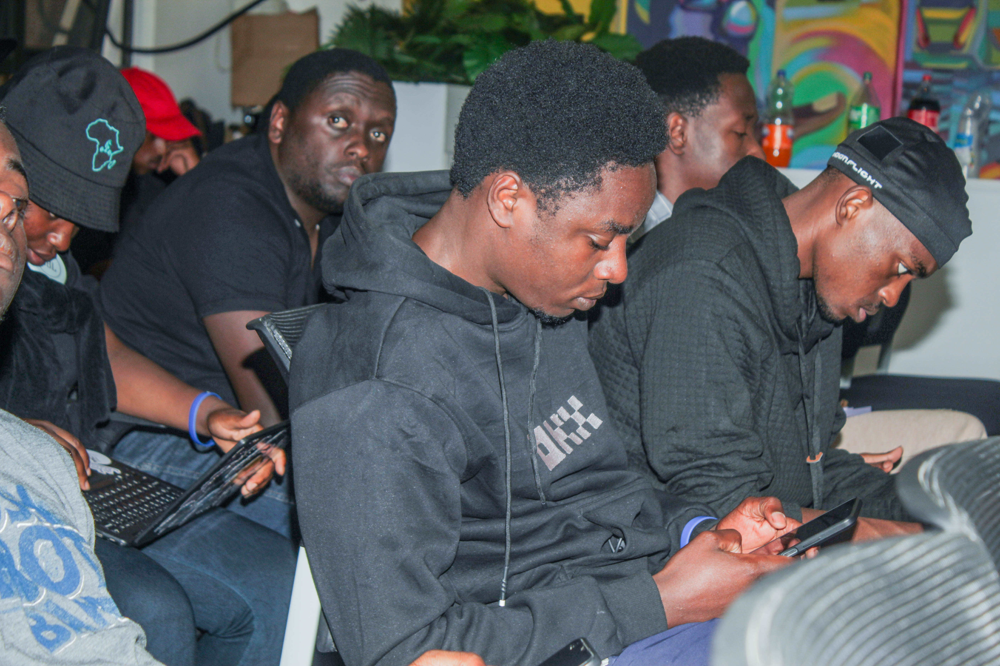
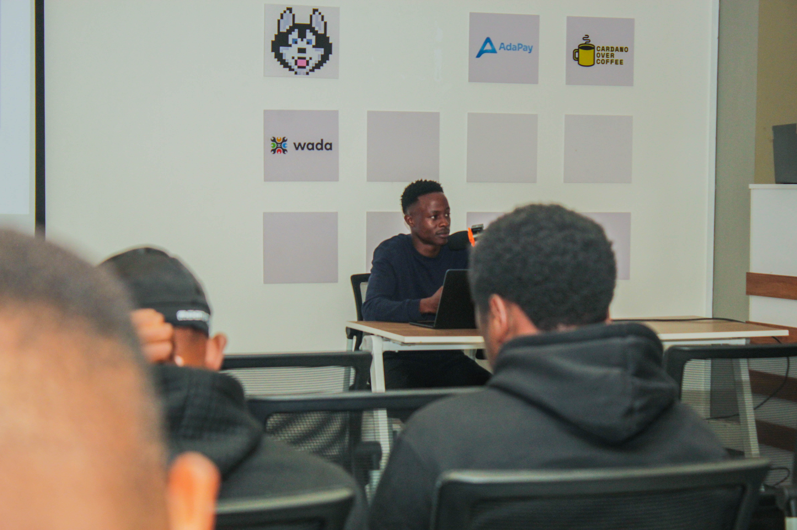
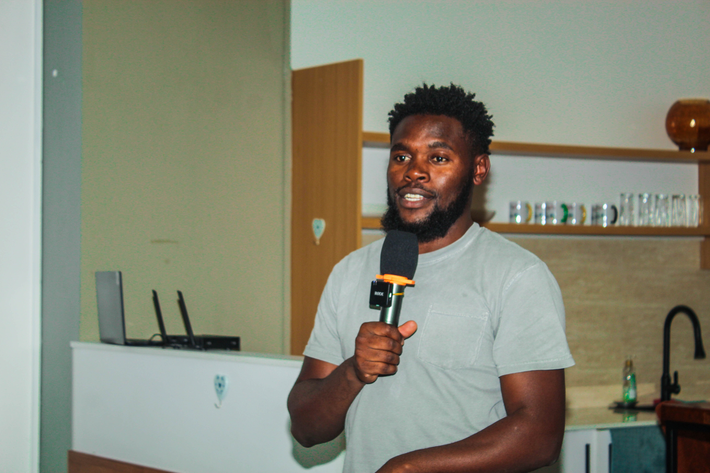
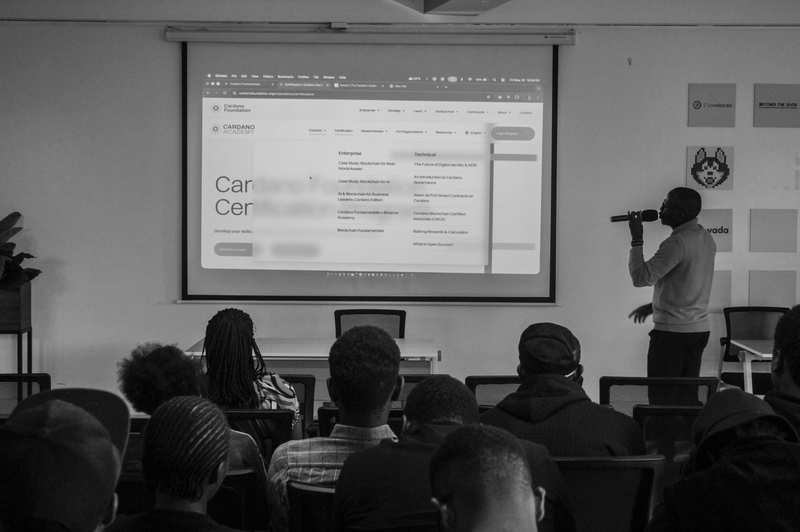
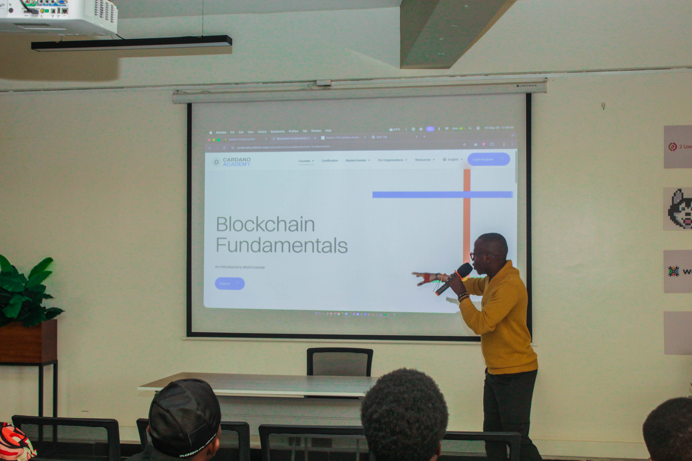
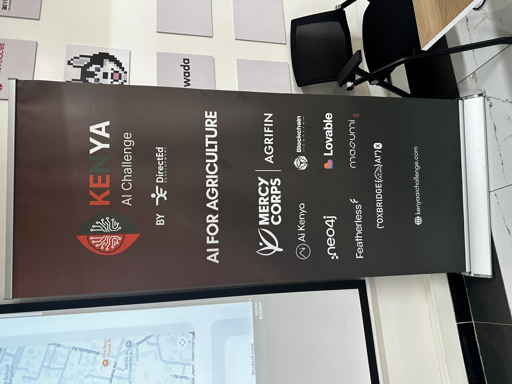
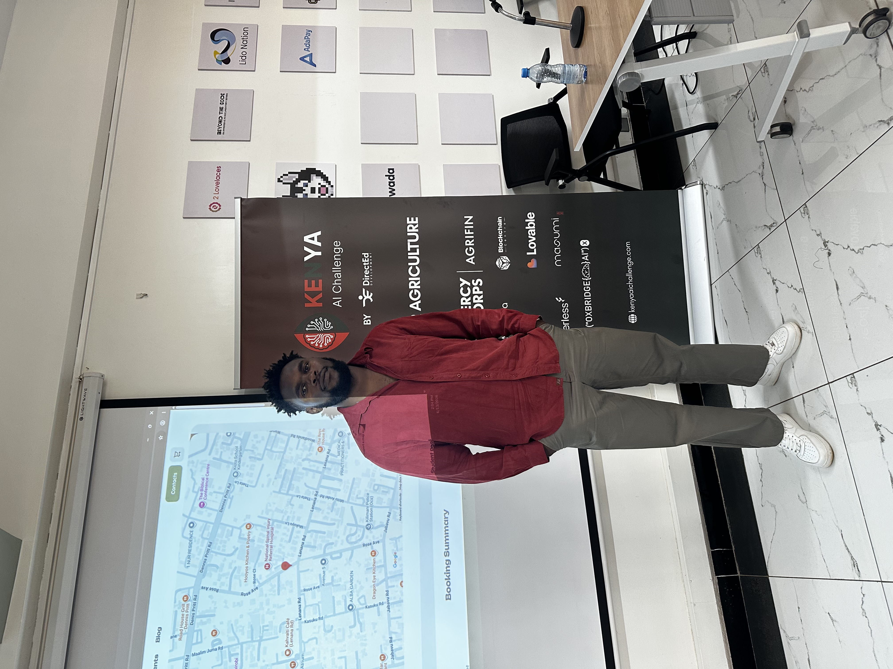
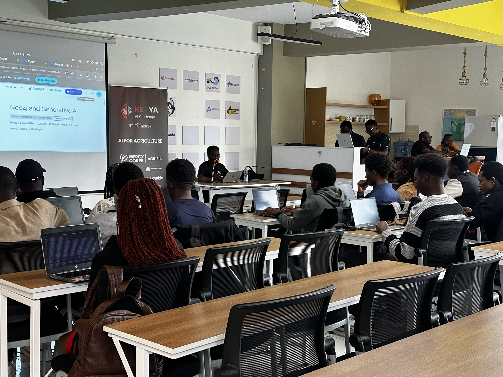

# Community Engagement Report – Q2 2026

As part of the Community Engagement milestone for Q2, I organized and facilitated community-focused events aimed at strengthening the local Cardano developer ecosystem and encouraging participation in open-source development.

The events organized were:

1. Cardano Hub Nairobi Monthly Meetup
2. Node Setup Event (Live Stream – Open Source Summit, Minnesota)
3. Kenya AI Challenge – Masumi and Cardano Integration Support

These events were designed to support developers, encourage collaboration, and promote active contributions to the Cardano ecosystem.

# Event 1: Cardano Hub Nairobi Monthly Meetup

## Event Description

The **Cardano Hub Nairobi Monthly Meetup** is a recurring community event focused on maintaining an active developer and builder community within the Cardano ecosystem in Nairobi.

This quarter's meetup featured a guest session delivered by community member **Emmanuel Mutisya**, who conducted a hands-on **smart contract workshop** for attendees.

## Activities During the Meetup

The meetup included the following segments:

- **Ecosystem Updates**
  Monthly updates on developments within the Cardano ecosystem, including governance discussions, tooling improvements, and community initiatives.

- **Smart Contract Workshop (Guest Session)**
  Community member **Emmanuel Mutisya** delivered a practical smart contract workshop, introducing attendees to smart contract development on Cardano and providing hands-on guidance.

- **Community Engagement Activities**
  Interactive sessions including games and quizzes where participants could earn small **ADA rewards** for participation.

## Outreach and Participation

The meetup attracted local developers, blockchain enthusiasts, and community members interested in Cardano development.

Participants were able to:

- Stay updated on current developments in the Cardano ecosystem
- Learn smart contract development from a community practitioner
- Engage in interactive activities and win ADA prizes
- Connect with other builders within the community

## Event Media

# Event 2: Node Setup Event (Live Stream – Open Source Summit, Minnesota)

## Event Description

A **Node Setup Workshop** was organized and live-streamed as part of the open-source event held in **Minnesota**, in collaboration with **Tex**, who facilitated the live stream from the event venue.

The session focused on practical node setup for developers looking to run or interact with the Cardano network, covering two approaches: a full node setup using **Mithril** and a lightweight alternative using **YACI Dev Kit**.

## Workshop Goals

The workshop aimed to:

- Lower the barrier for developers wanting to run or interact with a Cardano node
- Demonstrate a full node bootstrap process using Mithril for fast sync
- Introduce YACI Dev Kit as a lightweight option for developers who need local Cardano chain access without running a full node
- Reach a broader developer audience through live streaming from a major open-source event

## Workshop Structure

The session covered two practical node access setups:

- **Mithril Node Setup**
  A walkthrough of bootstrapping a Cardano node using Mithril, enabling developers to sync quickly without downloading the full chain history from scratch.

- **Light Node Access with YACI Dev Kit**
  An introduction to **YACI Dev Kit** as a developer-friendly toolkit for accessing Cardano chain data through a lightweight local setup, suited for development and testing without the overhead of a full node.

## Outcomes

The live-streamed format allowed the workshop to reach developers beyond the local Nairobi community, connecting with the wider open-source developer audience attending the Minnesota event.

Participants gained practical knowledge of:

- How to get a Cardano node running efficiently using Mithril
- How to use YACI Dev Kit for lightweight local chain access
- Practical tooling options for Cardano development environments

## Event 3: Kenya AI Challenge – Masumi and Cardano Integration Support

### About the Event

The **Kenya AI Challenge 2026** is a national AI competition organized by **DirectEd Development**, themed around **AI for Agriculture**. The challenge brought together student and developer teams from across Kenya to build AI-powered solutions addressing agricultural problems, with workshops, mentorship tracks, and a final showcase.

The event was held on **13 June 2026** at a co-working venue in Nairobi. Partners and sponsors included Mercy Corps, Agrifin, Blockchain Collective, Lovable, Masumi, Ai Kenya, Neo4j, Featherless, and OxBridge AI.

**Masumi** participated as a sponsor of the challenge. As part of that sponsorship, I attended to provide direct technical support to participating teams interested in integrating Masumi's agent monetisation infrastructure and Cardano payments into their projects.

### Role at the Event

My role was to support teams in understanding and implementing Masumi within their AI project prototypes. Masumi is a payment and monetisation layer for AI agents built on Cardano, allowing developers to charge for agent usage and settle payments on-chain. For teams building AI tools in the agriculture space, this opened a path toward sustainable revenue models and decentralised payment flows without relying on traditional payment rails.

Support provided included:

- Explaining the Masumi architecture and how it fits into AI agent workflows
- Walking teams through how to register an agent with Masumi and expose it as a paid service
- Demonstrating how Cardano transactions settle payments between agent consumers and providers
- Advising teams on how to structure their projects to make integration feasible within the challenge timeline

### Context: Why Masumi and Cardano at an AI Challenge

The Kenya AI Challenge brought together developers who were primarily focused on machine learning and data pipelines, with limited prior exposure to blockchain or decentralised payment infrastructure. Introducing Masumi in this context served two purposes: it gave teams a practical monetisation path for their AI tools, and it exposed a new cohort of developers to Cardano and its payment capabilities in a hands-on setting.

Intersect's presence on the venue sponsor wall alongside organisations like Lido Nation and AdaPay reflected the broader alignment between this event and the Cardano ecosystem's expansion into applied AI.

### What Was Achieved

- Direct technical engagement with AI challenge participants on Masumi and Cardano integration
- Expanded awareness of Cardano payment infrastructure among developers outside the traditional blockchain audience
- Strengthened the connection between the Masumi sponsorship and on-the-ground developer support
- Positioned Cardano tooling as relevant to the AI and agriculture technology space in Kenya

### Photos and Media

# Key Observations

Across these events, several insights emerged:

### Growing Community Contributions
Community members like Emmanuel Mutisya are stepping up to deliver sessions, reflecting growing depth within the local Cardano developer community.

### Community Members Taking on Governance Roles
Community member **Ian Njuguna** has been increasing his involvement in Intersect matters and recently applied for a **Constitutional Committee seat**. This reflects a meaningful progression — from attending community events to actively participating in Cardano governance — and is a strong indicator that the local community is maturing beyond technical engagement into ecosystem stewardship.

### Demand for Practical Node Tooling Guidance
There is strong interest among developers in understanding how to set up and interact with Cardano nodes. Lightweight alternatives like YACI Dev Kit are especially appealing for development environments.

### Reach Through Live Streaming
Live streaming from external events such as the Minnesota open-source summit significantly extends the reach of workshops beyond the local community.

# Contribution to the OSO Mission

These events supported the mission of the Open Source Office by:

- Expanding engagement with developers in the Nairobi blockchain community and beyond
- Enabling community members to lead technical sessions, building internal capacity
- Demonstrating practical tooling options that lower the barrier to Cardano open-source contribution
- Reaching a broader global developer audience through live-streamed events
