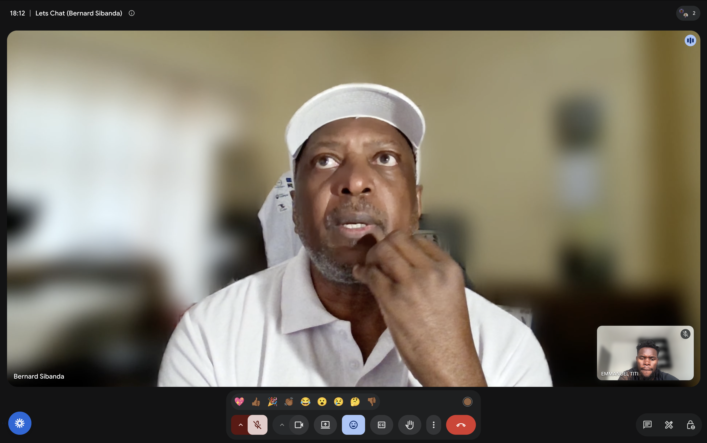

# Innovation & Technology Advancement – Q2 2026

**Milestone Goal:** Foster Innovation and Technology Advancement

**Acceptance Criteria:** Facilitate 1 feedback session with core contributors to test potential innovations.

## Feedback Session: WIMS-Cardano and ADA Sisters

**Date:** 26 June 2026
**Format:** Video call (Google Meet)
**Participants:** Bernard Sibanda (Founder, WIMS-Cardano), Emmanuel Titi (Intersect DevEx)

### About WIMS-Cardano

WIMS-Cardano (Women In Move Solutions) is a Cardano-based blockchain community founded in 2018 by Bernard Sibanda. It focuses on empowering women through blockchain education, the WIMT token, and decentralised tools built on Cardano.

### What Was Discussed

The session focused on alignment between WIMS-Cardano and ADA Sisters, and how WIMS can support ADA Sisters in building a women-focused Cardano developer community in Nairobi.

Topics covered:

- How WIMS's community model and experience can be applied to the ADA Sisters programme
- Areas where WIMS can provide direct support
- Shared goals around women empowerment and blockchain participation on Cardano

### Outcome

Bernard confirmed interest in supporting ADA Sisters. The agreed next step is a follow-up meeting with Tex and the ADA Sisters team to formally exchange ideas and define how the two initiatives will work together.

Sources:
- [WIMS-Cardano](https://cardano.wims.io/)
- [WIMS Cardano Forum](https://forum.cardano.org/t/we-are-wims-cardano-no-turning-back/137788)
