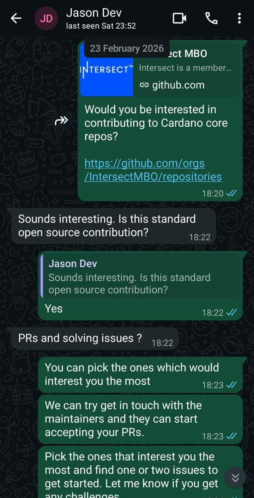
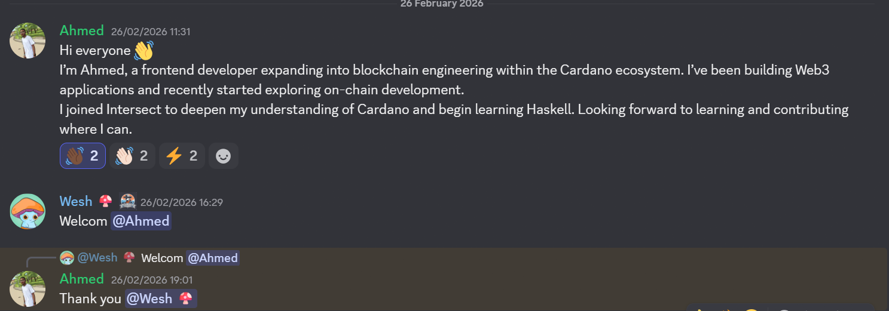

# Milestone Report: Developer Onboarding to Working Groups (Q1 2026)

**Reporting Advocate:** Harun Waweru Mwangi
**Milestone Period:** Q1 2026
**Contract Milestone:** Yes

**Goal:** Connect with developers from the community, encourage attendance to DevEx and Technical working groups, and maintain documentation specific to development on Cardano.

---

## Summary

I onboarded three new developers to the Intersect and Cardano ecosystem this quarter through 1-on-1 sessions and the DevEx Working Group. Each individual was introduced to IntersectMBO, directed to relevant working groups, and given clear next steps for participation and contribution.

---

## Developers Onboarded (Q1 2026)

### 1. Vinit Inamke (Konma Lab)

Vinit was introduced to the Intersect ecosystem and collaboration opportunities within IntersectMBO, with a discussion of both the Developer Advocate Program and the Maintainer Retainer Program. He was encouraged to attend Open Source Committee meetings to build visibility and community trust. Vinit also presented Konma's projects, MyOS, HaskLedger, and Carbon Ledger, as part of Session 09 of the DevEx Working Group, and was directed to the Intersect Discord and relevant committee calendars.

---

### 2. Jayson Amati

Jayson was introduced to Intersect and IntersectMBO and received a walkthrough of the [developer-experience repository](https://github.com/IntersectMBO/developer-experience), covering its structure, open issues, and contribution process. He was introduced to the Maintainer Retainer Program and directed to the Developer Experience Working Group and Intersect Discord. Jayson was tasked with reviewing active Cardano repositories and selecting one to contribute to.

---

### 3. Kadiri Ahmed Tunde

Kadiri was guided through navigating the Cardano developer ecosystem, covering both the Haskell learning path and the Aiken smart contract path as an accessible entry point. He was directed to the Intersect Discord, specifically the developer watercooler, Open Source Committee, and Developer Experience Working Group, and encouraged to engage with the community early for long-term mentorship and guidance.

---

## Acceptance Criteria Met

✅ **Minimum of 2 new developers onboarded per quarter**
Result: 3 developers onboarded (Vinit Inamke, Jayson Amati, Kadiri Ahmed Tunde)

---
