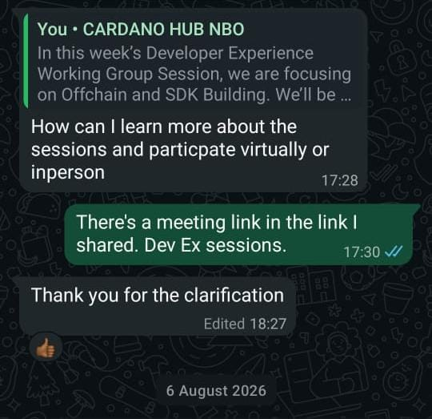

# Milestone Report: Onboarding New Developers (Q2 2026)

- **Reporting Advocate:** Harun Waweru Mwangi
- **Milestone Period:** Q2 2026
- **Working Group:** Developer Experience (DevEx)
- **Contract Milestone:** Yes

**Goal:** Connect community developers to DevEx and technical working groups while maintaining Cardano development documentation and learning materials.

---

## Overview

During Q2 2026, I used direct WhatsApp outreach and follow-up guidance to encourage developers to attend DevEx Working Group sessions and explore Cardano contribution opportunities.

The following are four examples from one DevEx session, rather than a complete list of developers engaged across the quarter.

| Developer | Outcome |
|---|---|
| Gideon | Joined a DevEx Working Group session following direct outreach. |
| Gitonga Victor | Joined a DevEx Working Group session following direct outreach. |
| Sammy Mumbere | Joined a DevEx Working Group session following direct outreach. |
| Sylus Cheruiyot | Joined a DevEx Working Group session following direct outreach. |

The outreach shared the session focus, participation options, and meeting link. Follow-up conversations provided additional mentorship and project-engagement opportunities.

---

## Documentation and Learning Materials

Q2 onboarding was supported by published session notes, recordings, and resources covering off-chain SDKs, AI-assisted development, and production Cardano applications. The materials are listed in the [Q2 DevEx Working Group Sessions Report](Q2_2026_DevEx_WG_Sessions_Report.md), with the underlying repository work recorded in the [Q2 Developer-Experience Repository Contributions Report](Q2_2026_DevEx_Repo_Contributions_Report.md).

Related one-to-one conversations are recorded in the [Q2 Meetings Report](Q2_2026_Meetings_Report.md).

---

## Outcome

- Four onboarding examples from one session, exceeding the minimum target of two developers.
- Additional developers engaged across other Q2 sessions.
- Visible technical documentation and learning materials maintained for new Cardano developers.
