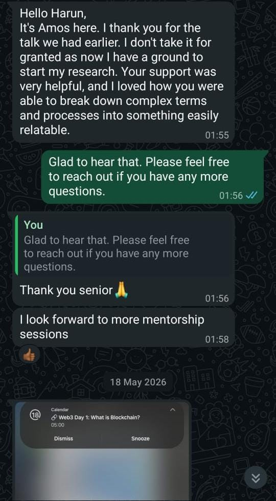
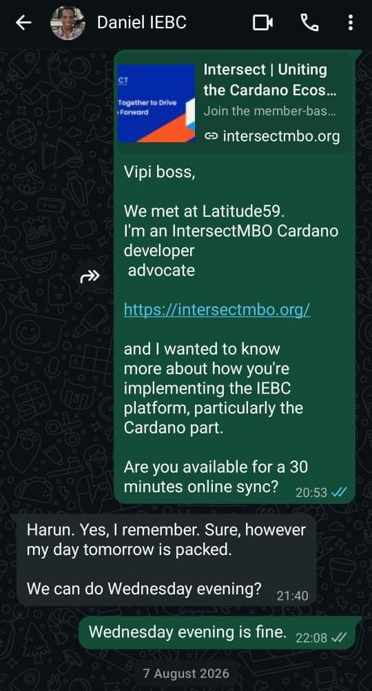

# Milestone Report: Meetings (Q2 2026)

- **Reporting Advocate:** Harun Waweru Mwangi
- **Milestone Period:** Q2 2026
- **Working Group:** Developer Experience (DevEx)
- **Contract Milestone:** Yes

**Goal:** Maintain a DevEx Working Group meeting cadence and hold conversations that help new developers enter Intersect and the Cardano ecosystem.

---

## Overview

During Q2 2026, I maintained the DevEx Working Group cadence and remained available for direct developer onboarding and contribution guidance.

---

## Working Group Cadence

I led or co-led three technical DevEx sessions during the quarter. Dates, topics, recordings, and session materials are available in the [Q2 DevEx Working Group Sessions Report](Q2_2026_DevEx_WG_Sessions_Report.md).

---

## Developer Conversations

### Amos

I introduced Amos to Web3 and blockchain concepts and helped him establish a starting point for further research. His follow-up confirmed that the discussion was useful and that he wanted further mentorship sessions.

### Daniel – Open-Source IEBC Platform

I introduced Daniel to Intersect and discussed the Cardano component of his open-source IEBC platform through WhatsApp. He also accepted an invitation for a 30-minute follow-up conversation.

Working Group outreach and participant examples are recorded in the [Q2 Developer Onboarding Report](Q2_2026_Developer_Onboarding_Report.md).

---

## Outcome

- DevEx Working Group cadence maintained through three led or co-led sessions.
- Minimum of two new-developer conversations completed through Amos and Daniel.
- Additional outreach created contribution and project-engagement pathways.
