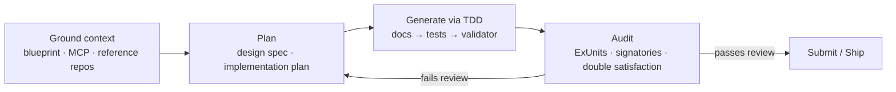

# Using AI in Your Cardano Dev Workflow

AI coding tools are now standard in the developer toolkit. However, using them effectively on Cardano presents unique challenges compared to Web2 or account-based blockchain ecosystems. This session outlines a repeatable workflow for building **correct, secure, and cost-efficient** Cardano applications using AI, and it covers the tooling (MCP servers, skills, local models) that closes the gap between a generic AI assistant and a Cardano-aware one.

:::warning A Caveat Up Front
AI is not yet ready to build a full smart contract from a single prompt without friction. Expect to iterate across several prompts. The goal of this workflow is to reduce that number and to keep the developer firmly in control of correctness and security.
:::

---

## The Workflow at a Glance

The rest of these notes expand on this loop. The headline shift is from *generation* (asking AI to write code) to *orchestration* (grounding, planning, and auditing around the AI).

---

## 1. Why Cardano is Uniquely Challenging for AI

Standard AI workflows often fail in the Cardano context for two main reasons.

### The Mental Model Mismatch
Most AI models are trained on account-based logic (common in other blockchain ecosystems and Web2 backends). Cardano's **eUTxO model** is a different paradigm.
- **The Pitfall**: AI often tries to "mutate state" or assumes a running program, whereas Cardano smart contracts are **validators**: pure functions that verify state transitions. The off-chain code builds the transaction; the validator only says yes or no.

### Knowledge Cutoffs & Ecosystem Velocity
The Cardano toolchain moves fast, and there are several programming paradigms for building on it. Toolkits and languages have all evolved well beyond their initial versions:

- **Off-chain / SDKs**: Mesh, Lucid Evolution, Blaze
- **On-chain languages**: Aiken, Plutus / Plinth, plus higher-level approaches like TX3 and Scalus
- **The Pitfall**: Because Ethereum, ERC-20, and Web3 content has been on the internet far longer, models have far more (and more confident) training data for account-based logic than for Cardano. AI will happily generate code for outdated APIs without warning.

:::tip The Core Habit: Version Grounding
Instead of prompting from scratch, anchor your prompt in your actual source files. Use your `plutus.json` blueprint and pin specific library versions (for example `@meshsdk/core@^1.0.0`) so the AI has the correct context rather than a guess from its training data.
:::

---

## 2. Plan Before You Prompt: Systematic Orchestration

The most impactful shift is moving from **generation** to **orchestration**. Rather than asking the AI to "write code," ask it to "build a plan" first. Planning is roughly 90% of the job.

### Decompose the Feature First
Before a single line of validator or off-chain logic is written, use AI to answer these five architectural questions:
1. **Actors**: Who is involved (User, Merchant, Protocol)?
2. **UTxOs**: What is being consumed and produced?
3. **Logic**: What should the validator check to allow spending?
4. **Datum**: What structure represents the contract state?
5. **Redeemers**: What actions is the validator expected to handle?

Writing the plan first surfaces ambiguities (for example, "what happens if a user cancels mid-period?") at the design phase rather than the deployment phase.

### Draft a Design Specification Document
A practical habit: have the LLM draft a **design specification document** before any validator code. This forces a shared understanding of what the code is supposed to do, and it makes the later mistakes (the LLM will make some) easy to spot and correct. Once the spec exists, asking for a validator or an SDK endpoint becomes far more reliable.

### Use "Plan Mode"
Modern tools can generate an **implementation plan file** before touching code: an overview of every file to be added or edited, often with an interaction schema you can visualize. Review and edit this plan (remove, add, reshape) before allowing the tool to write code. It is normal to spend 30+ minutes on a single planning pass. Some assistants (for example Gemini) already write an implementation plan by default, and they get better at it when you train them with your conventions.

---

## 3. Grounding AI in Your Codebase

AI accuracy correlates directly with context quality. Anchor prompts in these "Ground Truths":

### A. The Plutus Blueprint (`plutus.json`)
The blueprint is the ultimate source of truth for hashes and schemas. Paste the relevant validator section into your prompt to eliminate hallucinated field names and type errors. Ultimately, it is the `plutus.json` that confirms whether you built the thing correctly.

### B. Library Specificity
Specify exact versions to prevent API mixing.
- **Good**: "Build this transaction using `@meshsdk/core@^1.0.0` (or `lucid-evolution`, `blaze`)."
- **Bad**: "Use a Cardano SDK." (Vague prompts waste iterations and tokens while the model guesses at the tool.)

### C. The Design Specification
If you have a design doc, feed it to the AI first. This ensures the AI understands the "why" before it attempts the "how."

### D. Open-Source Reference Repositories
Point the AI at an existing validator, datum, or repository with similar functionality and ask it to follow those patterns for your use case. In practice, feeding relevant open-source Aiken / Plutus / Plinth repositories (for example the many validator patterns published by teams like Anastasia Labs) is one of the highest-leverage grounding moves. Often a single instruction ("refer to this link and follow how it was implemented") is enough for the model to find and reuse the right pattern.

---

## 4. MCP: Model Context Protocol

A recurring theme: how do we stop the AI reading **outdated** documentation? The strongest answer today is **MCP (Model Context Protocol)**.

### What it is
MCP lets an AI tool talk to external tools and documentation **directly**, instead of you pasting a GitHub link every time. Think of it as an API built for documentation: when configured for a library at a specific version, the assistant requests live, version-accurate information rather than relying on stale training data.

### Example: Mesh
Mesh ships a strong AI integration. From its site you can:
- **Install skills** directly (a library of Mesh skills the assistant can request from).
- **Add an MCP server** so the assistant queries the latest Mesh documentation and best practices live.
- **Download a skills file** that bundles Mesh instructions for offline use.

With the MCP configured, a prompt like "integrate wallet connection in my app" causes the assistant to read the Mesh documentation first and generate code that follows Mesh's actual API, instead of emitting generic TypeScript that ignores the SDK.

### Scope: project vs user vs global
Skills and MCP servers can be configured for a **single project**, for a **specific user**, or **globally** on your machine (a shared library every project can link to). Choose based on whether the context is project-specific or something you always want available.

### When to use which grounding mechanism

| Mechanism | Best for | Pros | Cons |
|---|---|---|---|
| **MCP server** | Live, version-accurate docs while coding | Always current; no manual pasting; best practices baked in | Requires internet; needs API key / setup |
| **Downloadable skill file** | Offline or fixed-context work | Works without internet; portable | Can drift out of date; manual refresh |
| **Pasting repo links / snippets** | One-off grounding | Zero setup | Manual; easy to under-specify; mixes versions |

:::note
MCP needs an internet connection because each request behaves like an API call. A downloaded skills file is the offline fallback.
:::

---

## 5. Skills, Rules, and Test-Driven Generation

Beyond grounding, you can encode *how you want the AI to work* using rules, skills, and sub-agents (supported by tools such as Claude Code, Cursor, and Kiro).

### Rules
Rules constrain behavior across a project or globally. Useful examples raised in the session:
- Keep commits clean (for example, do not add unrelated "co-authored-by" trailers).
- "Code like a human": do not dump huge diffs; cap how much code is produced at once.

### Test-Driven Development with AI
A workflow that materially reduces the number of prompts needed:
1. Have the LLM draft the **design specification** (see Section 2).
2. Start with **empty / stub validators**.
3. Write (or have the LLM write) the **tests** first, based on the spec and the validator's intended behavior.
4. Only then ask the LLM to implement the **validator**, using the tests and documentation as context.
5. Run the tests; feed failures back.

Encoding this exact loop as a reusable **skill** (for example a personal "Aiken on-chain" skill) means the assistant already knows to check for documentation, generate tests, and then implement, with accumulated rules from past errors making it sharper over time. None of this yet produces a correct validator in one prompt, but it has been enough to write a significant smart contract in a single day.

---

## 6. Where AI Falls Short (The Reality Check)

:::warning Security & Cost Warning
AI-generated on-chain code should always be reviewed by a developer before production use.
:::

| Pitfall | What goes wrong | How to mitigate |
|---|---|---|
| **Code bloat / ExUnits** | AI re-implements built-ins and writes verbose validators that inflate execution budget and script size. Cardano caps transaction size (~16 KB), and every byte of a validator counts. | Profile against actual execution units; ask the AI to prefer built-ins; review for redundancy. |
| **Missing signatory checks** | Validator allows unauthorized users to spend a UTxO. | Explicitly verify required signers in the validator and in review. |
| **Double satisfaction** | An attacker crafts a transaction that satisfies one validator check while siphoning value to a second output (for example minting without pinning the policy ID or quantity, so an extra output drains assets). | Check outputs specifically (address, quantity, policy ID); never validate value generically across outputs. |
| **Account-based "shadows"** | AI assumes mutable state and edits values in place. | In eUTxO, state is consumed and recreated as a new output. If code mutates state, stop and re-examine the architecture. |

---

## 7. For Maintainers: AI Verification Gates

As AI increases the *volume* of contributions, maintainers face more PRs of uneven quality (it is easy for a contributor to hand an issue to an AI and push the result without understanding the context). Manual review does not scale to that volume.

The recommended response is to add an **AI verification layer to CI**, on top of the usual format and lint checks in the GitHub workflow:
- Keep new PRs in **draft** until automated checks pass.
- Let an AI review step spend real time (even up to an hour) checking that the change meets the issue's requirements and respects repository context, before a human reviews.
- Combine with existing automated verification (formatting, type checks, tests) so maintainers receive fewer low-quality PRs.

This protects maintainer time and keeps quality high as contribution volume rises.

---

## 8. Saving on Tokens: Local Models & Emerging Tools

Token cost is currently the biggest practical constraint. A few directions explored in the session:

- **Local LLMs**: Running models such as **Qwen** and **Gemma** locally for simpler tasks keeps token spend down. Accuracy is not yet on par with hosted frontier models for on-chain work, so the next step is wiring local models to MCP servers to improve code accuracy.
- **Git Nexus**: A tool that lets you use the LLM of your choice with your own skills, connects to a number of MCP servers out of the box, and builds Obsidian-style mind maps of your project. Useful for visualizing a codebase. (Mentioned as a lead to explore, not yet battle-tested.)

---

## Open Questions & Action Items for the Ecosystem

These came up live and are worth carrying forward as DevEx work:

- **Cardano on-chain repositories do not yet ship MCP servers.** As developers increasingly rely on MCP to code quickly, the absence of MCP servers for our on-chain repos is a real onboarding gap. Providing them would let developers build against current, correct context instead of stale documentation.
- **Track the Cardano MCP proposal** (Leon Nation has a Cardano MCP proposal in progress) and consider how DevEx can support or align with it.
- **Maintainer tooling**: standardize an AI verification step across DevEx repositories.

---

## Key Takeaways

- **Orchestrate, don't just generate**: you are the architect; the AI is the builder. Planning is ~90% of the job.
- **Ground everything**: anchor prompts in `plutus.json`, pinned library versions, design specs, and reference repos. Prefer **MCP servers** for live, version-accurate context.
- **Generate via TDD**: spec, then tests on empty validators, then the validator. Encode the loop as a reusable skill.
- **Audit before shipping**: review every AI-generated validator for **ExUnit cost**, **signatory checks**, and **double satisfaction**.
- **Plan for scale**: add AI verification gates in CI so maintainers are not buried by high-volume, low-context PRs.

---

*These notes belong to the Q2 2026 Developer Experience Working Group.*
