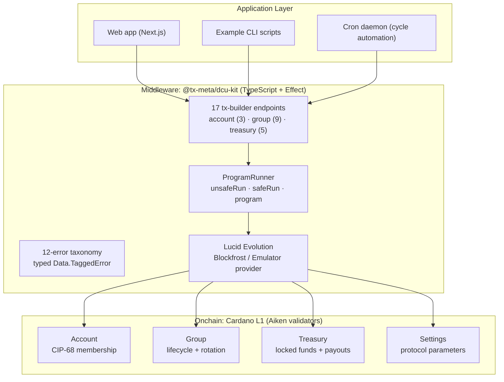
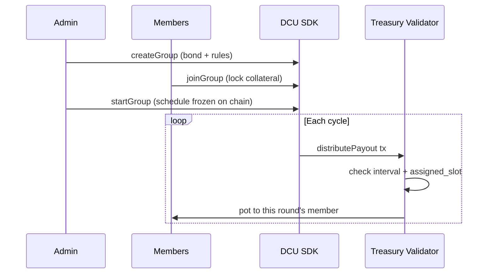

# Building a Production Cardano SDK: From Validators to dApp

## Introduction

This session continues the offchain and SDK building track started in Session 14. Where Session 14 walked through the structure of an offchain repository, this session goes end to end through the **practices of building and shipping a production-grade SDK**, using a source-available case study: the [DCU Toolkit](https://github.com/tx-meta/dcu-kit) (Decentralized Credit Unions), an MVP infrastructure for cooperative finance on Cardano under active development, together with a demo web application built on top of it. We cover why the product exists, how the three layers fit together, and what it takes to ship an SDK that other developers can actually build on.

## Session at a Glance

| | |
|---|---|
| **Date** | 11 June 2026 |
| **Format** | Technical walkthrough, CLI demonstration, and demo dApp walkthrough |
| **Presenter** | Harun Mwangi |
| **Case study** | DCU Toolkit on Cardano Preprod |

:::tip If you remember one thing from this session
On Cardano, **your application builds the transaction; the validator only says yes or no.** Smart contracts here are not running programs that hold your logic. They are pure functions that approve or reject a state transition. Everything in this session (the SDK, the endpoints, the UI) is layers of convenience around that one idea. If you keep this mental model, the rest of the ecosystem stops being confusing.
:::

---

## Why This Exists

Group savings schemes — Chamas, Tontines, Susu, Chit funds, Tandas — are how [419 million adults save semi-formally](https://www.findevgateway.org/blog/2022/09/path-financial-inclusion-must-include-saving-small-groups) worldwide. They run on social trust, and the recurring failure is always the same shape: a treasurer or organizer holds the pooled funds with no enforceable rules, and eventually someone absconds with the pot. Regulation and audits are post-hoc, and a plain app with a database only relocates the trust to whoever runs the server.

The DCU Toolkit is an experiment: **what happens when the treasurer is a validator?** Custody without a custodian, with rules enforced before each transaction instead of audited after the collapse. Cardano fits because its deterministic eUTxO model makes each group's treasury an independent UTxO whose outcome is known before the transaction is submitted. Each failure mode maps to a validator check:

| What goes wrong today | What the toolkit encodes |
|---|---|
| Treasurer absconds with the pot | Funds locked in a Treasury UTxO; payouts enforced by the validator |
| Organizer rug-pulls the group | `creator_bond` forfeited if the group is deleted while members are active |
| Member defaults mid-cycle | `collateral_rounds` locked at join; pro-rata pots so the cycle never stalls |
| Fake identities, no audit trail | CIP-68 membership token pairs; full history on chain |

Its validators, SDK, specification, and examples are public and auditable. The toolkit remains under active development; whether it holds up with real communities, under real usability constraints, is what the experiment is for.

---

## What is a ROSCA?

A **Rotating Savings and Credit Association**: a fixed group of members each contribute the same amount per cycle, and each cycle one member receives the entire pooled pot, rotating until everyone has been paid exactly once.

The on-chain mapping:
- **Members** lock ADA (or any Cardano-native token, including stablecoins) into a Treasury UTxO when they join.
- **Intervals** advance on a fixed schedule encoded in the Group datum.
- **Payouts** go to the member whose `assigned_slot` matches the current interval, enforced by the Treasury validator.

---

## What the Creator Configures

A group is not one fixed shape. At creation the admin sets rules that the validators then enforce for the group's lifetime. Two of these change how money actually moves:

- **Contribution funding — per-cycle or full-upfront.** Members can be required to deposit each interval, or allowed to deposit their whole multi-cycle obligation at once (useful for crowdfunding-style groups, or a member who wants to prepay while the validator draws it down each interval). A validator can never *prevent* a deposit, only enforce a minimum — so full-upfront is an allowance layered on top of the per-cycle rule, not a separate contract.
- **Payout mode — push or claim.** In **push (auto-pay)** mode the payout is permissionless: the member, the admin, or any participant can submit the transaction, and the validator sends the pot to whoever holds the current interval's `assigned_slot`. This is the safeguard against a recipient who goes silent. In **claim (pool)** mode the member must actively withdraw their own pot.

The economic parameters — cycle length, contribution amount, joining fee, early-exit penalty, and the `creator_bond` — are also set here and frozen on chain at `startGroup`.

---

## Architecture: Three Layers



The session focused on the **middle layer**, since that is where most Cardano application developers will spend their time.

---

## Onchain, Briefly: CIP-68 Pairs

Smart contracts cannot efficiently read data stored in tokens sitting in user wallets, so every identity in the protocol is a **synchronized pair of tokens**:

| Token | Where it lives | What it does |
|---|---|---|
| **Reference NFT** `(100)` | Locked at the validator | Holds the datum that contracts can read |
| **User Auth NFT** `(222)` | The user's wallet | Proves ownership and authorizes transactions |

Both are minted atomically. At validation time the contract reads the reference datum and checks that you hold the auth token, **without ever taking it from your wallet**. The same pattern covers groups: the Group Reference NFT lives at the Group validator, and the Group Auth NFT is admin authority.

Validators in the repo: `account-validator.ak`, `group-validator.ak`, `treasury-validator.ak`, `settings-validator.ak`, plus `always-fails.ak` used to permanently lock deployed reference scripts.

---

## The SDK: Every Endpoint Returns a ProgramRunner

```typescript
import { createAccount } from "@tx-meta/dcu-kit";

const [selected_out_ref] = await lucid.wallet().getUtxos();

// 1. Throws on failure (scripts, quick tooling)
const tx = await createAccount(lucid, { selected_out_ref }).unsafeRun();

// 2. Returns an Either, never throws (production UIs)
const result = await createAccount(lucid, { selected_out_ref }).safeRun();

// 3. Raw Effect, composes with your own pipeline
const program = createAccount(lucid, { selected_out_ref }).program();
```

One API, three execution modes, chosen by the integrator rather than the SDK author. `selected_out_ref` is consumed as entropy for the CIP-68 token name, which guarantees global uniqueness (no two UTxOs ever share a `txHash#index`).

### Why Effect Instead of Plain Promises

For financial transactions, failure handling is the product, not an afterthought:
- A **12-error taxonomy** of typed `Data.TaggedError`s (missing UTxO, invalid datum, insufficient funds, and so on), each catchable by tag.
- No uncaught throws: builders fail gracefully and explicitly.
- Pipelines compose: retry, timeout, and concurrency come for free.

### Anatomy of an Endpoint

```text
sdk/src/
├── endpoints/distributePayout.ts   ← one file per operation
│     Config type → datum/redeemer schemas → tx build → makeReturn()
├── core/
│   ├── errors.ts        ← 12-error taxonomy (built FIRST)
│   ├── types.ts         ← datum + redeemer schemas
│   ├── plutus.json      ← compiled Aiken blueprint
│   └── validators/      ← policy IDs derived from the blueprint
└── index.ts             ← barrel export
```

Build order when starting any SDK: errors, then types, then validators, then endpoints one at a time, each with its test before the next. This layout is identical across the team's SDKs, so integrators learn it once.

### The Endpoint Surface

The seventeen endpoints — three on Account, nine on Group, five on Treasury — cover the whole lifecycle. Beyond the create/join/start/payout path shown below, the Group set also includes `updateGroup`, `deleteGroup`, `exitGroup`, `triggerNextCycle`, `extendGraceWindow`, and `terminateDefault`:

- `triggerNextCycle` advances the rotation using the rules frozen at `startGroup`.
- `extendGraceWindow` gives a member who is behind more time before removal.
- `terminateDefault` removes a member who has missed contributions in a contributing-path group.

---

## Preprod Walkthrough: From SDK to Demo dApp

The `sdk/examples/` directory contains CLI scripts for exercising the endpoints. Together they support the protocol lifecycle:

```bash
pnpm run create-account     # ADMIN, USER1, USER2
pnpm run create-group       # ADMIN bonds and sets the rules
pnpm run join-group         # users lock collateral
pnpm run start-group        # rotation schedule fixed on chain
pnpm run distribute-payout  # validator pays round 1's member
pnpm run claim-payout
```

During this session, the live walkthrough covered the first part of that lifecycle:

1. Building and locally packing the SDK for use by the examples.
2. Running the `create-account` example against Preprod.
3. Inspecting the resulting transaction and its CIP-68 reference and user NFTs.
4. Connecting a Lace test wallet to the demo dApp and creating an on-chain account.
5. Creating a new group, presented as a **circle** in the user interface, with its cycle and financial rules.
6. Joining an existing circle from another wallet and observing its pot grow from 50 ADA to 100 ADA.

The rotation was not started during the session because of time. The sequence below shows the complete protocol flow that the SDK is designed to support, rather than only the transactions executed in the live demonstration.



Reference scripts are deployed once per SDK version and permanently locked at an `alwaysFails` address: they are a witness-size optimization and can never move funds.

---

## The Integration Case Study: A Demo Web App (Kyama)

The proof that the SDK works for a real integrator is the [live demo web application](https://kyama.vercel.app/) built on top of it. One button, all the layers:

**"Distribute Payout"** → React hook → `distributePayout(lucid, cfg).safeRun()` → tx phase UI → confirmed on chain.

- Typed errors map one-to-one to user-facing messages.
- `tx-phase` and `tx-progress-bar` components are driven directly by SDK states.
- Wallet connect, chain-data hooks, and route guards all sit on the same 17 endpoints.

In the demo UI, groups are presented to users as **circles** (or pods) — friendlier language for the same on-chain group. The live walkthrough created a circle on Preprod and joined an existing one from a second wallet; because each join makes the member's first contribution, the pot visibly grew from 50 ADA to 100 ADA.

---

## Production Discipline

| CI job | Gates |
|---|---|
| Verify SDK | format, lint, types, build, emulator test suite |
| Verify Aiken | format, build, on-chain unit tests |
| Verify Design Specs | the Typst design spec must compile |

All three must pass before merge; publishing fires on a GitHub Release, with a CHANGELOG and MIGRATION guide per version. "Production smart contract" means the spec, the validators, and the SDK are versioned and gated together.

---

## The Recipe: Applying This to Your Own SDK

Everything above generalizes. If you are wrapping your own validators in an SDK, this is the method:

1. **Start from the blueprint.** `plutus.json` is the contract between layers; derive policy IDs and script addresses from it, never hardcode them.
2. **Build the error taxonomy first.** Every endpoint imports from it, and typed failures designed up front are what make a polished UX possible downstream.
3. **Schemas next.** Datum and redeemer types must mirror the onchain design spec exactly; blueprint alignment is the offchain code's entire job.
4. **One endpoint at a time, each with its test before the next.** An emulator test suite keeps the loop fast; save Preprod for end-to-end verification.
5. **Return a runner, not a promise.** Expose throw / Either / Effect modes and let the integrator choose; an SDK should not impose its error-handling style.
6. **Ship examples as first-class code.** One CLI script per endpoint doubles as living documentation and a manual integration test.
7. **Version the whole stack together.** Blueprint, SDK, spec, and reference scripts in one release with CI gates on all of them; a recompiled validator must never silently strand your integrators.

---

## Open Problems (Honest Limitations)

This is an MVP under active development, and some failure modes are not yet fully solved. Naming them is part of the method:

- **The first recipient absconding is the hard case.** Once the first member receives the pot, nothing on chain compels them to keep contributing. There is no bulletproof fix today. The current safeguard is the `creator_bond`, which can be forfeited to cover members at risk; ideas under exploration include a **guarantor model** (a member's payout is backed by another party) and **equal-loss sharing** (a default is absorbed proportionally across the whole group, so no single member takes the entire hit).
- **Identity is a placeholder.** CIP-68 membership pairs give an audit trail, but they do not prove real-world identity. The intended direction is ZK-proofed KYC, so identity can be verified without being exposed on chain.
- **Governance is not multisig yet.** The creator/admin currently holds elevated control. Multisig is planned for sensitive actions such as proposals and voting, so control decentralizes as the protocol matures.

---

## Key Takeaways

- **Your app builds the transaction; the validator only approves or rejects.** This is the single mental model every Cardano newcomer should anchor on.
- **Real-world trust failures are the use case.** Each documented fraud maps to a specific validator check; smart contracts here are not abstract, they are a missing audit running before every transaction.
- **SDKs drive adoption.** Wrapping validators in a typed, well-documented SDK lets application developers build without reading Plutus or Aiken.
- **Design the failure paths first.** A typed error taxonomy built before any endpoint is what makes a polished UX possible downstream.
- **Ship the whole stack.** Blueprint, SDK, examples, docs, and CI gates moving in lockstep is what separates a demo from infrastructure.
- **Be explicit about what remains unsolved.** The session's closing discussion identified first-recipient default, real-world identity, dispute handling, and centralized admin control as open design problems rather than presenting the MVP as finished financial infrastructure.

---

*These notes belong to the Q2 2026 Developer Experience Working Group.*
